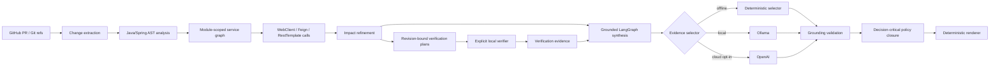

# ChangeGuard

**ChangeGuard is a deterministic-first cross-service change-impact and release-risk engine for Java/Spring microservices.**

Its core question is:

> **If this change is merged, what can break outside the files that changed?**

Most code-review tools stop at the diff. ChangeGuard connects provider-side changes to downstream services, explicit consumer call sites, targeted verification, and grounded AI synthesis while keeping source-of-truth facts deterministic.

```text
evidence -> inference -> verification -> grounded synthesis
```

The current package is the **`1.0.0rc1` release candidate**.

## What makes ChangeGuard different

A diff is often not enough to understand release impact. A Spring controller method may inherit an unchanged class-level route; a downstream client may still call an old endpoint; a nested Maven reactor may require a different verification command; and a model-generated explanation is only useful if it cannot invent evidence.

ChangeGuard addresses those problems with explicit boundaries:

- Git and static analysis establish facts.
- A module-scoped service/contract graph establishes cross-service relationships.
- Consumer-call matching refines impact candidates.
- Verification is planned deterministically and executed only when a user explicitly requests it.
- Generated verification plans are bound to the analyzed Git revision.
- Model-backed synthesis may select only existing evidence IDs.
- Deterministic guardrails and policy closure remain authoritative before rendering.

## Architecture



The model never receives authority to parse arbitrary source code, execute repository commands, create evidence IDs, or write an unconstrained final risk report.

## Supported evidence today

**Spring REST semantics**

- endpoint added / removed
- endpoint path changed
- HTTP method changed
- request signature changed
- response type changed
- class-level + method-level route composition from full before/after source

**Spring Security semantics**

- security policy added / removed / changed
- authorization selectors and actions
- explicitly disabled CSRF, CORS, HTTP Basic, and form login

**Cross-service evidence**

- Spring Cloud Gateway `lb://service` routes
- service URLs in configuration
- config-server imports
- explicit Java client service URLs
- WebClient fluent calls
- OpenFeign declarations
- RestTemplate calls
- module-scoped service identity

**Verification planning**

- endpoint-level impact only
- Maven module targeting
- nested reactor-root-aware `-f` and `-pl` commands
- exact analyzed Git-head binding for generated plans

Other engineering surfaces such as database, messaging, deployment, config, and observability are classified, but their deeper contract semantics are intentionally not presented as complete yet.

## Quick start

Requirements: Python 3.11+ and Java 17+.

```bash
python -m venv .venv
```

Windows PowerShell:

```powershell
.\.venv\Scripts\Activate.ps1
python -m pip install -e ".[dev]"
pytest
```

macOS/Linux:

```bash
source .venv/bin/activate
python -m pip install -e ".[dev]"
pytest
```

Build/test the JVM AST analyzer:

```bash
mvn -f analyzers/java-spring/pom.xml test
mvn -f analyzers/java-spring/pom.xml package
```

For repeated public GitHub analysis, set `GITHUB_TOKEN` to avoid the low unauthenticated API rate limit.

## Analyze a public pull request

Basic semantic analysis:

```powershell
changeguard pr `
  --repo spring-petclinic/spring-petclinic-microservices `
  --pr 494
```

Cross-service impact analysis:

```powershell
changeguard pr `
  --repo spring-petclinic/spring-petclinic-microservices `
  --pr 253 `
  --impacts
```

Create reviewable verification plans:

```powershell
changeguard pr `
  --repo owner/repository `
  --pr 123 `
  --verification-plan
```

`--verification-plan` implies semantic, dependency, and impact analysis. It does **not** execute remote project code.

Use `--json` to emit a `ChangeManifest`.

## Revision-bound verification

Generated PR verification plans carry the exact analyzed `expected_head`.

A plan can be executed explicitly from a local checkout:

```powershell
changeguard verify-plan `
  --manifest manifest.json `
  --repo . `
  --plan-index 0
```

Before Maven is resolved or project code executes, ChangeGuard reads:

```text
git rev-parse HEAD
```

If local `HEAD != expected_head`, verification returns `ERROR` and refuses execution. This prevents evidence derived from commit A from being silently associated with tests run against commit B.

The lower-level `changeguard verify` command remains available for explicit manual module checks and accepts an optional `--expected-head` binding.

## Grounded synthesis

Create a manifest first:

```powershell
changeguard pr `
  --repo SVB808/changeguard `
  --pr 16 `
  --verification-plan `
  --json |
  Out-File -Encoding utf8 manifest.json
```

Offline deterministic synthesis:

```powershell
changeguard synthesize --manifest manifest.json
```

Local Ollama selection:

```powershell
changeguard synthesize `
  --manifest manifest.json `
  --selector ollama `
  --model llama3.2:3b
```

Optional OpenAI selection:

```bash
python -m pip install -e ".[dev,ai]"
changeguard synthesize --manifest manifest.json --selector openai
```

PowerShell BOM-prefixed UTF-8 JSON is accepted.

### Evidence-selection boundary

Model-backed selectors receive typed evidence records and return only a structured list of evidence IDs. ChangeGuard then:

1. rejects unknown IDs,
2. rejects duplicate IDs,
3. enforces the evidence budget,
4. deterministically restores runtime-mandatory evidence,
5. fails closed if mandatory evidence itself exceeds the budget,
6. renders wording deterministically.

Runtime-mandatory evidence currently includes actual verification results, active impact candidates, and semantic changes linked to active impacts through runtime source-path provenance.

## Canonical end-to-end demo

The repository includes a reproducible public-PR workflow using `SVB808/changeguard#16`:

```text
public PR
  -> exact before/after Java analysis
  -> service + consumer-call evidence
  -> endpoint-level impacts
  -> revision-bound Maven plans
  -> optional explicit local verification
  -> grounded selector
  -> deterministic policy closure
  -> deterministic report
```

See [`docs/demo.md`](docs/demo.md) for the exact PowerShell commands and safety boundaries.

## Evaluation

ChangeGuard keeps deterministic impact evaluation separate from model-selection evaluation.

### Deterministic impact corpus

```powershell
changeguard evaluate --strict
```

The current `rest-impact-v3` controlled corpus contains 24 cases. CI requires all 24 disposition + verification-plan expectations to match. The evaluator also reports impact and endpoint TP/FP/TN/FN, precision/recall/FPR, technology breakdown, and deterministic-core latency.

These are **controlled-corpus metrics**, not production accuracy. Latency excludes GitHub access, JVM parsing, Maven execution, and model inference.

### Raw selector evaluation

```powershell
changeguard evaluate-selector `
  --selector ollama `
  --model llama3.2:3b `
  --warmup-runs 1 `
  --runs 3
```

Metrics include required-evidence recall, precision, distractor rate, distinct-consumer coverage, verification retention, grounding, latency, tokens, and repeated-run stability.

### Raw vs effective policy evaluation

```powershell
changeguard evaluate-selector-policy `
  --corpus benchmarks/evaluation/synthesis-selection-v2.json `
  --selector ollama `
  --model llama3.2:3b `
  --warmup-runs 1 `
  --runs 3
```

This reports model quality and post-policy effective quality from the **same provider call**, including runtime policy-mandatory retention and corpus-policy diagnostics. Deterministic corrections remain visible instead of being hidden inside an aggregate score.

### Production-shaped release evaluation

```powershell
changeguard evaluate-release `
  --selector deterministic `
  --runs 3 `
  --strict
```

`evaluate-release` combines:

- the `rest-impact-v3` deterministic gate, and
- `synthesis-selection-runtime-v1`, whose evidence is generated by the production `collect_evidence()` function from typed manifests/results.

For local model measurement:

```powershell
changeguard evaluate-release `
  --selector ollama `
  --model llama3.2:3b `
  --warmup-runs 1 `
  --runs 3
```

The overall release gate requires deterministic corpus exactness, full grounding, 100% effective runtime policy-mandatory retention, and no runtime-corpus policy-semantic contradictions. CI executes the deterministic release gate on Python 3.12. See [`docs/release-evaluation.md`](docs/release-evaluation.md).

## Seeded verification benchmarks

The repository contains controlled Maven fixtures for WebClient, OpenFeign, and RestTemplate path-break scenarios.

One seeded vertical is:

```text
provider GET /orders/{orderId}
        -> GET /purchases/{orderId}

Feign consumer still calls /orders/{orderId}
RestTemplate consumer still calls /orders/{orderId}

=> endpoint-level consumer impacts
=> targeted reactor-aware verification plans
=> controlled consumer contract-test failures
```

These fixtures test the deterministic vertical and command construction. They are not evidence that arbitrary real repositories will behave identically.

## Key safety / correctness invariants

- No automatic execution of remote PR code.
- Generated verification is bound to the analyzed Git revision.
- Unknown model evidence IDs fail grounding validation.
- The model cannot remove runtime-mandatory evidence from the effective report.
- Mandatory evidence over budget fails closed rather than silently truncating consumers.
- A passing command is not described as universal safety proof.
- A failing command is not described as automatic causal proof.
- Controlled benchmark scores are not labeled as production accuracy.
- Target repositories are never mutated by analysis.

## Current limitations

- Maven is the only verification build system currently implemented.
- Maven layout discovery uses direct reactor/module evidence rather than full effective-model/profile resolution.
- Consumer-call extraction focuses on static/literal routes supported by WebClient, Feign, and RestTemplate analyzers.
- Dynamic routes and unsupported client frameworks may remain at service-level evidence or be outside explicit call refinement.
- Database migration and messaging-contract semantics are not yet deep enough for release guarantees.
- A matching Git `HEAD` does not prove an otherwise clean/hermetic workspace.
- Model quality depends on provider/model/runtime; deterministic policy invariants are evaluated separately for this reason.
- OpenAI live execution requires an active API account/billing; CI validates only the provider request contract without network calls.

## Design decisions

Architecture decisions are recorded under [`docs/decisions`](docs/decisions). Important boundaries include deterministic-first analysis, module-scoped identity, reactor-aware verification, LangGraph grounding, provider-backed evidence-ID selection, local Ollama selection, model-evaluation protocol, deterministic decision-critical closure, revision binding, and runtime-shaped release evaluation.

## Release checklist

Before tagging V1:

```powershell
pytest
mvn -f analyzers/java-spring/pom.xml test
changeguard evaluate --strict
changeguard evaluate-release --selector deterministic --runs 3 --strict
changeguard --help
```

A live Ollama release-candidate measurement is useful but is intentionally separate from the offline deterministic release gate:

```powershell
changeguard evaluate-release `
  --selector ollama `
  --model llama3.2:3b `
  --warmup-runs 1 `
  --runs 3
```

## Post-V1 extensions

Useful follow-on work that should not block the V1 portfolio release:

- Gradle verification planning
- deeper database migration compatibility analysis
- messaging schema/consumer compatibility
- broader dynamic HTTP client extraction
- Pact/Testcontainers or sandbox-backed verification
- GitHub Check / PR comment integration
- a small hosted UI
- narrowly permissioned agent orchestration after tool boundaries remain explicit
