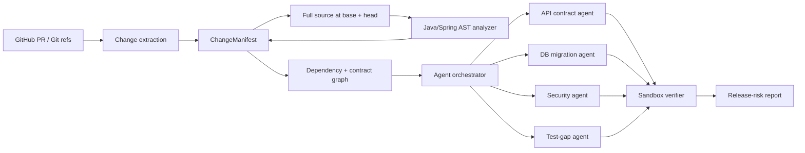

# ChangeGuard

ChangeGuard is a change-impact and release-risk engine for Java/Spring microservices.

The long-term goal is to answer a harder question than "does this PR look okay?":

> **If this change is merged, what can it break outside the files that changed?**

## Current milestone: deterministic evidence + Spring REST semantics

ChangeGuard deliberately separates observable facts from probabilistic reasoning.

The current pipeline can:

1. inspect local Git refs or a public GitHub pull request,
2. classify changed engineering surfaces,
3. fetch the full before/after Java source for changed files,
4. parse Spring controllers with a JVM AST analyzer,
5. emit structured REST endpoint changes.

There is still **no LLM in this stage**. Agent reasoning will be introduced only after the evidence layer is measurable and reliable.

### Current engineering surfaces

- API contract
- database
- security
- messaging
- configuration
- dependency/build
- Java code
- deployment
- observability

### Current Spring REST semantic changes

- endpoint added
- endpoint removed
- endpoint path changed
- HTTP method changed
- request signature changed
- response type changed

## Why deterministic-first?

An LLM should reason over evidence, not rediscover basic facts that Git and static analysis can provide more reliably.

For example, a PR diff may show only:

```java
@GetMapping("/health")
```

while the unchanged class-level annotation contains:

```java
@RequestMapping("/vets")
```

The semantic analyzer reads the full source at both Git revisions and derives the actual endpoint as `GET /vets/health`.

## Quick start

Python 3.11+ and Java 17+ are required for the current development build.

```bash
python -m venv .venv

# Windows PowerShell
.venv\Scripts\Activate.ps1

# macOS/Linux
# source .venv/bin/activate

pip install -e ".[dev]"
pytest
```

Build and test the Java/Spring analyzer:

```bash
mvn -f analyzers/java-spring/pom.xml test
mvn -f analyzers/java-spring/pom.xml package
```

The shaded analyzer JAR is written to:

```text
analyzers/java-spring/target/changeguard-java-analyzer.jar
```

### Analyze a public GitHub PR

No clone of the target repository is required:

```bash
changeguard pr \
  --repo spring-petclinic/spring-petclinic-microservices \
  --pr 494
```

Semantic analysis is enabled by default for changed Java files. Disable it when you only want V0-style surface classification:

```bash
changeguard pr \
  --repo spring-petclinic/spring-petclinic-microservices \
  --pr 494 \
  --no-semantic
```

Structured JSON output:

```bash
changeguard pr \
  --repo spring-petclinic/spring-petclinic-microservices \
  --pr 494 \
  --json
```

### Scan a local repository

```bash
changeguard scan --repo . --base HEAD~1 --head HEAD
```

## Example semantic output

```text
spring-petclinic-vets-service/.../VetResource.java
  status: modified
  language: java
  surfaces: java_code, api_contract
  semantic changes:
    ENDPOINT_ADDED
      after:  GET /vets/health | VetResource#health() -> String
```

## Architecture direction



## Planned next layers

- richer Spring REST semantics and type resolution
- security-policy semantic analysis
- cross-service dependency/contract graph
- specialized risk agents
- sandboxed verification
- benchmark suite with seeded regressions
- GitHub Check / PR integration

## Non-goals at this stage

- predicting whether a change is "safe"
- calling an LLM to parse source code
- opening or modifying pull requests in target repositories
- assigning arbitrary risk scores

Those features come only after the evidence pipeline is testable.
