# ChangeGuard

ChangeGuard is a change-impact and release-risk engine for Java/Spring microservices.

The core question is:

> **If this change is merged, what can it break outside the files that changed?**

ChangeGuard deliberately separates three stages:

```text
evidence -> impact inference -> verification
```

There is still **no LLM in the current implementation**. Deterministic evidence, impact refinement, and verification boundaries are being built first so later agents have something measurable to reason over.

## Current milestone: V3.0 targeted verification

The current pipeline can:

1. inspect local Git refs or a public GitHub pull request,
2. classify changed engineering surfaces,
3. fetch full before/after Java source at exact Git revisions,
4. parse Spring REST and Spring Security semantics with a JVM AST analyzer,
5. build a cross-service dependency graph,
6. extract explicit Java HTTP consumer calls,
7. join compatibility-sensitive provider changes with consumer evidence,
8. suppress unsupported service-level candidates without deleting their audit trail,
9. create targeted Maven verification plans for endpoint-level candidates,
10. explicitly execute those plans only in a user-supplied local workspace.

## Deterministic evidence currently supported

Engineering surfaces:
- API contract
- database
- security
- messaging
- configuration
- dependency/build
- Java code
- deployment
- observability

Spring REST semantic changes:
- endpoint added
- endpoint removed
- endpoint path changed
- HTTP method changed
- request signature changed
- response type changed

Spring Security semantic changes:
- security policy added
- security policy removed
- security policy changed
- authorization selectors/actions
- explicitly disabled CSRF, CORS, HTTP Basic, and form login

Cross-service evidence:
- Spring Cloud Gateway `lb://service` routes
- explicit service URLs in configuration
- explicit service URLs in Java `*Client`, `*Gateway`, and `*Connector` classes
- literal WebClient-style HTTP method + route extraction

## Why deterministic-first?

An LLM should reason over evidence, not rediscover basic facts that Git and static analysis can provide more reliably.

For example, a PR diff may show only:

```java
@GetMapping("/health")
```

while an unchanged class-level annotation contains:

```java
@RequestMapping("/vets")
```

ChangeGuard reads the full source at both revisions and derives the actual endpoint as `GET /vets/health`.

The same principle applies across services. A service-level dependency alone is not enough to claim breakage. If an explicit consumer call is available, ChangeGuard compares HTTP method and normalized route before keeping or suppressing an impact candidate.

## Quick start

Python 3.11+ and Java 17+ are required.

```bash
python -m venv .venv

# Windows PowerShell
.venv\Scripts\Activate.ps1

# macOS/Linux
# source .venv/bin/activate

pip install -e ".[dev]"
pytest
```

Build and test the Java/Spring analyzer:

```bash
mvn -f analyzers/java-spring/pom.xml test
mvn -f analyzers/java-spring/pom.xml package
```

The shaded analyzer JAR is written to:

```text
analyzers/java-spring/target/changeguard-java-analyzer.jar
```

For repeated public GitHub analysis, set `GITHUB_TOKEN` to avoid the low unauthenticated API rate limit.

## Analyze a public GitHub PR

Basic semantic scan:

```bash
changeguard pr \
  --repo spring-petclinic/spring-petclinic-microservices \
  --pr 494
```

Add dependency context:

```bash
changeguard pr \
  --repo spring-petclinic/spring-petclinic-microservices \
  --pr 494 \
  --dependencies
```

Generate/refine cross-service impact candidates:

```bash
changeguard pr \
  --repo spring-petclinic/spring-petclinic-microservices \
  --pr 253 \
  --impacts
```

Create reviewable verification plans for endpoint-level candidates:

```bash
changeguard pr \
  --repo owner/repository \
  --pr 123 \
  --verification-plan
```

`--verification-plan` implies semantic, dependency, and impact analysis. It does **not** execute remote build code.

Structured JSON is available with `--json`.

## Build a service dependency graph

```bash
changeguard graph \
  --repo spring-petclinic/spring-petclinic-microservices \
  --ref main
```

The graph output includes dependency edges and any explicit consumer HTTP calls ChangeGuard can extract.

## Explicit local verification

Remote PR analysis never silently runs project-controlled Maven plugins or scripts.

To execute a targeted consumer-module test run, provide a local workspace explicitly:

```bash
changeguard verify \
  --repo /path/to/checked-out/repository \
  --consumer api-gateway \
  --module spring-petclinic-api-gateway
```

The initial Maven command is:

```text
mvn -pl <consumer-module> -am test
```

Verification records process evidence: status, exit code, duration, and bounded stdout/stderr tails.

A `PASSED` build does not automatically mean a change is safe. A `FAILED` build does not automatically prove that an impact candidate caused the failure.

See `docs/verification.md` for the execution boundary and `docs/evaluation/public-pr-cases.md` for real public benchmark cases.

## Public benchmark examples

Petclinic PR #494:
- provider fact: `ENDPOINT_ADDED GET /vets/health`
- dependent fact: `api-gateway -> vets-service`
- impact result: zero candidates because the endpoint is additive

Petclinic PR #253:
- provider facts: request signatures changed for `POST /owners` and `PUT /owners/{ownerId}`
- V2.1 result: two service-level candidates for `api-gateway`
- V2.2 observed consumer call: `GET /owners/{ownerId}`
- refined result: zero active candidates, two suppressed candidates retained for audit

## Architecture

```mermaid
flowchart LR
  PR[GitHub PR / Git refs] --> E[Change extraction]
  E --> S[Java/Spring semantic evidence]
  S --> G[Service dependency graph]
  G --> C[Consumer HTTP call evidence]
  C --> I[Impact candidate refinement]
  I --> P[Verification plan]
  P --> V[Explicit local verifier]
  V --> R[Verification evidence]
  R --> A[Future agent orchestration]
  A --> O[Release-risk report]
```



## Current non-goals

- claiming that a passing test run proves safety
- claiming that a failing test run proves causality
- executing arbitrary remote PR build code automatically
- using an LLM to parse raw source code
- assigning arbitrary risk scores
- mutating target repositories

## Planned next layers

- stronger verification: targeted tests, Pact, Testcontainers, sandboxing
- database migration semantics
- messaging contract semantics
- agent orchestration over deterministic evidence
- benchmark/evaluation suite with precision, recall, false-positive rate, latency, and cost
- GitHub Check / PR integration
