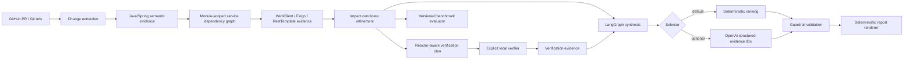

# ChangeGuard

ChangeGuard is a cross-service change-impact and release-risk engine for Java/Spring microservices.

The core question is:

> **If this change is merged, what can it break outside the files that changed?**

The project is built around one evidence discipline:

```text
evidence -> impact inference -> verification -> grounded synthesis
```

Deterministic analysis remains the source of truth. LangGraph and an optional model-backed selector operate only on evidence ChangeGuard has already produced.

## Current milestone: V5.1 grounded model-backed evidence selection

The current pipeline can:

1. inspect local Git refs or a public GitHub pull request,
2. classify changed engineering surfaces,
3. fetch full before/after Java source at exact Git revisions,
4. parse Spring REST and Spring Security semantics with a JVM AST analyzer,
5. discover Maven services without Petclinic-specific naming assumptions,
6. build a module-scoped cross-service dependency graph,
7. extract explicit WebClient, OpenFeign, and RestTemplate consumer-call evidence,
8. join compatibility-sensitive provider changes with consumer evidence,
9. suppress non-matching service-level candidates while preserving their audit trail,
10. create reactor-root-aware Maven verification plans,
11. explicitly execute those plans only in a user-supplied local workspace,
12. evaluate deterministic behavior against a versioned labeled REST corpus,
13. synthesize supplied facts/inferences/verification evidence through LangGraph,
14. optionally let an OpenAI model select only existing evidence IDs using strict structured output.

The final synthesis wording and claim semantics remain deterministic even when model-backed selection is enabled.

## Deterministic evidence currently supported

Engineering surfaces:

- API contract
- database
- security
- messaging
- configuration
- dependency/build
- Java code
- deployment
- observability

Spring REST semantic changes:

- endpoint added
- endpoint removed
- endpoint path changed
- HTTP method changed
- request signature changed
- response type changed

Spring Security semantic changes:

- security policy added
- security policy removed
- security policy changed
- authorization selectors/actions
- explicitly disabled CSRF, CORS, HTTP Basic, and form login

Cross-service evidence:

- Spring Cloud Gateway `lb://service` routes
- explicit service URLs in configuration
- explicit service URLs in Java client-like classes
- WebClient fluent calls
- OpenFeign declarations
- RestTemplate calls
- config-server imports

## Why deterministic-first?

An LLM should reason over evidence, not rediscover basic facts that Git and static analysis can provide more reliably.

For example, a PR diff may show only:

```java
@GetMapping("/health")
```

while an unchanged class-level annotation contains:

```java
@RequestMapping("/vets")
```

ChangeGuard reads the full source at both revisions and derives the actual endpoint as `GET /vets/health`.

The same principle applies across services. A service dependency alone is not enough to claim breakage. When explicit consumer-call evidence is available, ChangeGuard compares HTTP method and normalized route before keeping or suppressing an impact candidate.

## Quick start

Python 3.11+ and Java 17+ are required.

```bash
python -m venv .venv

# Windows PowerShell
.venv\Scripts\Activate.ps1

# macOS/Linux
# source .venv/bin/activate

python -m pip install -e ".[dev]"
pytest
```

Build and test the Java/Spring analyzer:

```bash
mvn -f analyzers/java-spring/pom.xml test
mvn -f analyzers/java-spring/pom.xml package
```

For repeated public GitHub analysis, set `GITHUB_TOKEN` to avoid the low unauthenticated API rate limit.

## Analyze a public GitHub PR

Basic semantic scan:

```bash
changeguard pr \
  --repo spring-petclinic/spring-petclinic-microservices \
  --pr 494
```

Add dependency context:

```bash
changeguard pr \
  --repo spring-petclinic/spring-petclinic-microservices \
  --pr 494 \
  --dependencies
```

Generate/refine cross-service impact candidates:

```bash
changeguard pr \
  --repo spring-petclinic/spring-petclinic-microservices \
  --pr 253 \
  --impacts
```

Create reviewable verification plans:

```bash
changeguard pr \
  --repo owner/repository \
  --pr 123 \
  --verification-plan
```

`--verification-plan` implies semantic, dependency, and impact analysis. It does **not** execute remote project code.

Structured JSON is available with `--json`.

## Build a service dependency graph

```bash
changeguard graph \
  --repo spring-petclinic/spring-petclinic-microservices \
  --ref main
```

Service identity is scoped by module path, so two separate Maven workspaces may both contain a logical `provider-service` without being conflated.

## Reactor-root-aware verification plans

Nested Maven builds are preserved explicitly. A plan may look like:

```text
mvn -f benchmarks/client-style-path-break/pom.xml -pl feign-consumer-service -am test
```

instead of assuming the Git repository root contains the relevant aggregator POM.

Remote PR analysis only creates plans. Local execution remains explicit:

```bash
changeguard verify \
  --repo /path/to/checked-out/repository \
  --consumer api-gateway \
  --module spring-petclinic-api-gateway
```

Verification records process evidence: status, exit code, duration, and bounded stdout/stderr tails.

A `PASSED` build does not automatically mean a change is safe. A `FAILED` build does not automatically prove that an impact candidate caused the failure.

## Seeded end-to-end verification cases

The repository contains controlled Maven benchmarks that prove the full deterministic vertical.

WebClient-style seeded path break:

```text
provider path change
  -> exact WebClient consumer-call match
  -> endpoint-level impact
  -> targeted Maven plan
  -> consumer contract test failure
```

Feign + RestTemplate seeded path break:

```text
provider GET /orders/{orderId}
        -> GET /purchases/{orderId}

OpenFeign consumer still calls /orders/{orderId}
RestTemplate consumer still calls /orders/{orderId}

=> 2 endpoint-level impacts
=> 2 targeted Maven plans
=> 2 controlled consumer contract failures
```

## Controlled benchmark evaluation

The current corpus is `rest-impact-v3` with 24 labeled cases.

```bash
changeguard evaluate
changeguard evaluate --details
changeguard evaluate --json
changeguard evaluate --strict
```

The evaluator reports:

- impact-detection TP/FP/TN/FN, precision, recall, and false-positive rate,
- endpoint-evidence precision/recall/FPR,
- verification-plan decision accuracy,
- p50/p95 in-process deterministic-core latency,
- consumer-technology breakdown for explicitly labeled WebClient, Feign, and RestTemplate cases.

The current controlled corpus is expected to remain 24/24 under CI. These are **controlled-corpus metrics**, not claims of production accuracy. Deterministic-core latency excludes GitHub access, JVM parsing, Maven execution, and model inference.

## Grounded LangGraph synthesis

V5 adds a four-node synthesis graph:

```text
ChangeManifest + optional VerificationResult(s)
        ↓
collect_evidence
        ↓
select_evidence
        ↓
validate_selection
        ↓
render_report
```

Evidence is typed as:

- `fact` — deterministic semantic/dependency/plan evidence,
- `inference` — ChangeGuard impact/suppression conclusions,
- `verification` — outcomes of explicitly executed checks.

Create a deterministic manifest:

```powershell
changeguard pr `
  --repo SVB808/changeguard `
  --pr 16 `
  --verification-plan `
  --json | Out-File -Encoding utf8 manifest.json
```

Synthesize it offline:

```powershell
changeguard synthesize --manifest manifest.json
```

PowerShell BOM-prefixed UTF-8 JSON is accepted.

## Optional OpenAI evidence selector

Install the optional provider dependency:

```bash
python -m pip install -e ".[dev,ai]"
```

Set `OPENAI_API_KEY`, then opt in explicitly:

```bash
changeguard synthesize \
  --manifest manifest.json \
  --selector openai
```

The model receives already-derived evidence records and returns only a strict structured list of evidence IDs. It cannot write the final report. The LangGraph validation node rejects unknown, duplicate, or over-limit IDs before deterministic rendering.

A different model can be selected with `--model`. Synthesis JSON records selector/model provenance and provider-reported input/output token counts when available.

See `docs/synthesis.md` and ADRs 0011–0012 for the grounding boundary.

## Architecture



## Current non-goals

- claiming that a passing test run proves safety
- claiming that a failing test run proves causality
- claiming small controlled-corpus scores are production accuracy
- executing arbitrary remote PR build code automatically
- using an LLM to parse raw source code
- allowing a model to invent evidence or free-form risk findings
- assigning arbitrary risk scores
- mutating target repositories

## Planned next layers

- evaluate model evidence-selection quality against labeled synthesis cases
- track model latency and token/cost behavior separately from deterministic analysis
- add database migration and messaging contract semantics
- stronger verification with Pact/Testcontainers/sandboxing
- narrowly permissioned specialized agents after tool boundaries are explicit
- GitHub Check / PR integration
