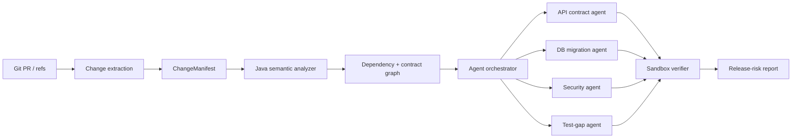

# ChangeGuard

ChangeGuard is a change-impact and release-risk engine for Java/Spring microservices.

The long-term goal is to answer a harder question than "does this PR look okay?":

> **If this change is merged, what can it break outside the files that changed?**

## V0: deterministic change manifest

The first milestone intentionally contains **no LLM**.

Given two Git refs, ChangeGuard:

1. reads the changed files,
2. extracts the patch for each file,
3. classifies the engineering surface touched by the change,
4. emits a structured `ChangeManifest`.

This manifest becomes the stable input contract for later AST analyzers and agent workflows.

### Current categories

- API contract
- database
- security
- messaging
- configuration
- dependency/build
- general Java code

## Why deterministic-first?

An LLM should reason over evidence, not discover basic facts that Git and static analysis can provide more reliably.

Later versions will add:

- Java/Spring semantic analysis
- cross-service dependency/contract graph
- specialized risk agents
- sandboxed verification
- benchmark suite with seeded regressions
- GitHub Check / PR integration

## Quick start

```bash
python -m venv .venv

# Windows PowerShell
.venv\Scripts\Activate.ps1

# macOS/Linux
# source .venv/bin/activate

pip install -e ".[dev]"
pytest
```

Scan the current repository:

```bash
changeguard scan --repo . --base HEAD~1 --head HEAD
```

Structured JSON output:

```bash
changeguard scan --repo . --base HEAD~1 --head HEAD --json
```

## Example output

```text
src/main/java/com/acme/orders/OrderController.java
  status: modified
  language: java
  surfaces: api_contract
  evidence: Spring web annotation changed

src/main/resources/db/migration/V12__add_status.sql
  status: added
  language: sql
  surfaces: database
  evidence: Database migration file changed
```

## Architecture direction



## Non-goals for V0

- predicting whether a change is "safe"
- calling an LLM
- opening pull requests
- modifying source code
- assigning arbitrary risk scores

Those features come only after the evidence pipeline is testable.
